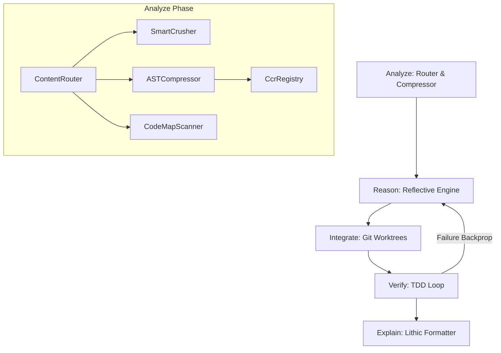

# ARIVE MCP Server

[](https://bun.sh/)
[](https://www.typescriptlang.org/)
[](https://modelcontextprotocol.io/)

A complete, production-ready TypeScript/Node.js Model Context Protocol (MCP) server that implements the **ARIVE** framework: **Analyze**, **Reason**, **Integrate**, **Verify**, **Explain**. 

ARIVE merges the concepts, workflows, and efficiency pipelines of four core development paradigms into a unified local assistant engine:
1.  **headroom** (`chopratejas/headroom`): Local, reversible context compression.
2.  **sequentialthinking** (`modelcontextprotocol/servers/sequentialthinking`): Step-by-step reasoning with reflective backtracking.
3.  **superpowers** (`obra/superpowers`): Isolated Git worktree workspaces, subprocess runners, and Test-Driven Development (TDD) loop verification.
4.  **caveman** (`JuliusBrussee/caveman`): Lithic, token-saving telegraphic communication formatters.
5.  **codemap** (`JordanCoin/codemap`): Compact structural file tree and dependency flow mapping.

---

## Architecture & Phases



### A - Analyze (Context Compression)
*   **Content Router**: Automatically classifies incoming text blocks into `json`, `code`, `logs`, or `prose` to determine the best compression strategy.
*   **Smart JSON Crusher**: Recursively traverses JSON data, collapsing large arrays with more than 2 elements and replacing them with a summary description while maintaining SRE/error fields.
*   **AST Code Compressor**: Discards comments, JSDocs, whitespace runs, and formatting details using the TypeScript Compiler API.
*   **Cache Aligner**: Normalizes spacing and carriage returns to ensure maximum KV cache hit rates on providers like Anthropic or Gemini.
*   **CCR Registry**: A hash-based Content-Compressed Retrieval store (`ccr:sha256_hash`). Allows referencing large payloads using 68-character hashes.
*   **CodeMap Scanner**: Inspired by `JordanCoin/codemap`. Recursively scans folders to generate directory trees, maps TypeScript export/import dependency flows, and queries Git branch statistics.

### R - Reason (Step-by-Step Logic Sequences)
*   **Reflective Engine**: Tracks thought sequences in a graph. Supports branching and backtracking: if a backtracking revision is requested, thoughts after the revision target are flagged as `"backtracked"` (retained in log but deactivated), and a new active sequence branches out. State is saved atomically to `.arive/thinking_state.json`.

### I - Integrate (Isolated Workspaces)
*   **Git Worktree Isolation**: Spawns isolated, concurrent task directories under `.arive-worktrees/<taskId>` using Git worktrees. Prevents modifying the user's active files during automated refactoring/mutation runs.
*   **Subagent Runner**: Spawns CLI commands inside the isolated directory, guarding against sandbox directory escapes and command injection.

### V - Verify (TDD & Verification Loops)
*   **TDD Orchestrator**: Executes verification tests (e.g., `bun test`, `pytest`) inside the isolated CWD.
*   **Backprop Reflex**: Integrates assertion failures back into the reasoning history, prompting the engine to revise its hypothesis on subsequent iterations.
*   **CCR Verification**: Validates that retrieved raw content matches its original hash key before usage.

### E - Explain (Lithic Token Compression)
*   **Lithic Formatter**: Compresses conversational text into token-saving, telegraphic styles:
    *   `lite`: Strips filler words ("just", "actually", "basically").
    *   `full`: Strips articles ("the", "a") and auxiliary verbs ("is", "are").
    *   `ultra`: telegraphic keyword mapping (e.g. `tests/verify.test.ts:24 fail`).
    *   `normal`: Returns raw text without modification.

---

## Exposed MCP Tools

1.  **`arive_compress`**: Takes a string and returns compressed text. Large payloads are stored in the CCR registry and return a `ccr:sha256` reference.
    *   *Parameters*: `content` (string), `contentType` (`"json" | "code" | "logs" | "prose" | "auto"`), `forceCcr` (boolean).
2.  **`arive_decompress`**: Expands a `ccr:sha256` reference back to original raw content.
    *   *Parameters*: `hash` (string).
3.  **`arive_think`**: Adds a step to the reflective reasoning graph, supporting backtracking.
    *   *Parameters*: `thought` (string), `thoughtNumber` (number), `totalThoughts` (number), `nextThoughtNeeded` (boolean), `isRevision` (boolean), `revisesThoughtNum` (number), `branchToThoughtNum` (number).
4.  **`arive_integrate`**: Controls Git worktree workspace creation, execution, and cleanup.
    *   *Parameters*: `taskId` (string), `action` (`"create" | "execute" | "cleanup"`), `branchName` (string), `command` (string).
5.  **`arive_verify`**: Runs tests in the isolated worktree directory and injects failures back into the reasoning history.
    *   *Parameters*: `taskId` (string), `testCommand` (string).
6.  **`arive_explain`**: Formats conversational text into a token-saving lithic brevity style.
    *   *Parameters*: `message` (string), `brevity` (`"lite" | "full" | "ultra" | "normal"`).
7.  **`arive_codemap`**: Generates project structures, directory trees, imports/exports dependency flows, or Git diff stats.
    *   *Parameters*: `action` (`"tree" | "dependencies" | "diff"`), `dir` (string), `excludes` (string[]), `maxDepth` (number), `targetBranch` (string).

---

## Installation & Setup

### Requirements
*   [Bun](https://bun.sh/)
*   [Git](https://git-scm.com/)

### Clone and Install
```bash
# Clone the repository
git clone https://github.com/your-username/arive.git
cd arive

# Install dependencies
bun install
```

### Running Tests
```bash
bun test
```

### Type Checking
```bash
bun x tsc --noEmit
```

---

## Client Configurations

To register the ARIVE MCP server in your local AI editing clients:

### Gemini CLI (`antigravity-cli`)
Add this configuration to your local config at `%USERPROFILE%\.gemini\antigravity-cli\mcp_config.json`:
```json
{
  "mcpServers": {
    "arive": {
      "command": "bun",
      "args": [
        "run",
        "C:/Users/sixxx/Documents/development/ARIVE_Analyze_Reason_Integrate_Verify_Explain_MCP/src/index.ts"
      ]
    }
  }
}
```

### Claude Desktop
Add this to your configuration under `appData/Roaming/EasyCode/claude_desktop_config.json` (or standard `claude_desktop_config.json` configuration path):
```json
{
  "mcpServers": {
    "arive": {
      "command": "bun",
      "args": [
        "run",
        "C:/Users/sixxx/Documents/development/ARIVE_Analyze_Reason_Integrate_Verify_Explain_MCP/src/index.ts"
      ]
    }
  }
}
```

---

## License
MIT License. See [LICENSE](LICENSE) for more details.
