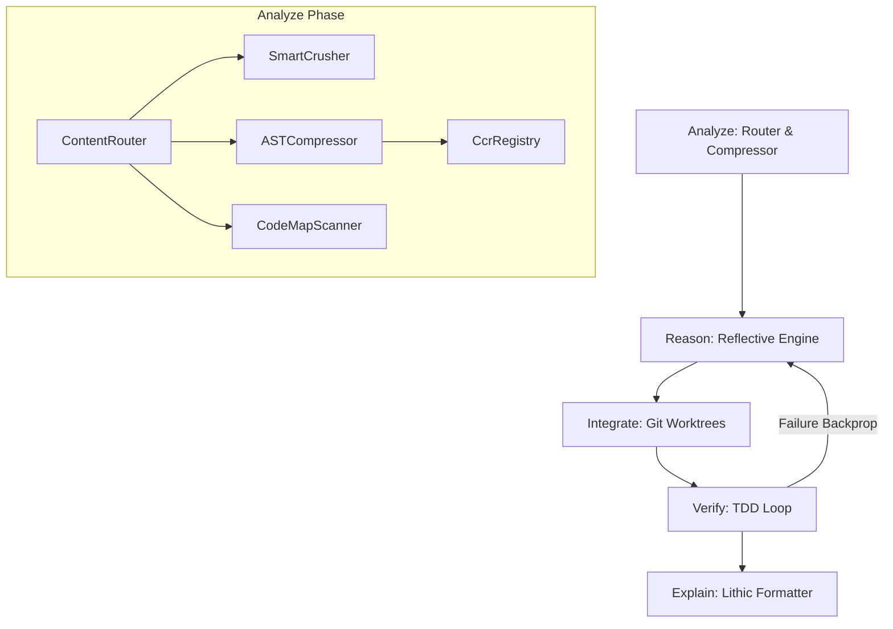

# ARIVE MCP Server

[](https://bun.sh/)
[](https://www.typescriptlang.org/)
[](https://modelcontextprotocol.io/)
[](LICENSE)

A complete, production-ready TypeScript Model Context Protocol (MCP) server that implements the **ARIVE** framework: **Analyze**, **Reason**, **Integrate**, **Verify**, **Explain**. 

ARIVE merges local context compression, step-by-step backtracking reasoning graphs, isolated Git worktree runners, test verification loops, and telegraphic language output into a single, cohesive developer assistant engine.

---

## Architecture & Phases



### A - Analyze (Context Compression)
*   **Content Router**: Automatically classifies incoming text blocks into `json`, `code`, `logs`, or `prose` to determine the optimal compression strategy.
*   **Smart JSON Crusher**: Recursively traverses JSON data, collapsing large arrays with more than 2 elements and replacing them with a summary description while preserving SRE/error fields.
*   **AST Code Compressor**: Discards comments, JSDocs, whitespace runs, and formatting details using the TypeScript Compiler API.
*   **Cache Aligner**: Normalizes spacing and carriage returns to ensure maximum KV cache hit rates on providers like Anthropic or Gemini.
*   **CCR Registry**: A hash-based Content-Compressed Retrieval store (`ccr:sha256_hash`). Allows referencing large payloads using 68-character hashes.
*   **CodeMap Scanner**: Recursively scans folders to generate directory trees, maps TypeScript export/import dependency flows, and queries Git branch statistics.

### R - Reason (Step-by-Step Logic Sequences)
*   **Reflective Engine**: Tracks thought sequences in a graph. Supports branching and backtracking: if a backtracking revision is requested, thoughts after the revision target are flagged as `"backtracked"` (retained in log but deactivated), and a new active sequence branches out. State is saved atomically to `.arive/thinking_state.json`.

### I - Integrate (Isolated Workspaces)
*   **Git Worktree Isolation**: Spawns isolated, concurrent task directories under `.arive-worktrees/<taskId>` using Git worktrees. Prevents modifying the user's active files during automated refactoring/mutation runs.
*   **Subagent Runner**: Spawns CLI commands inside the isolated directory, guarding against sandbox directory escapes and command injection.

### V - Verify (TDD & Verification Loops)
*   **TDD Orchestrator**: Executes verification tests (e.g., `bun test`, `pytest`) inside the isolated CWD.
*   **Backprop Reflex**: Integrates assertion failures back into the reasoning history, prompting the engine to revise its hypothesis on subsequent iterations.
*   **CCR Verification**: Validates that retrieved raw content matches its original hash key before usage.

### E - Explain (Lithic Token Compression)
*   **Lithic Formatter**: Compresses conversational text into token-saving, telegraphic styles:
    *   `lite`: Strips filler words ("just", "actually", "basically").
    *   `full`: Strips articles ("the", "a") and auxiliary verbs ("is", "are").
    *   `ultra`: telegraphic keyword mapping (e.g. `tests/verify.test.ts:24 fail`).
    *   `normal`: Returns raw text without modification.

---

## Exposed MCP Tools

### `arive_compress`
Compresses strings based on code, JSON, logs or prose optimizations, returning hash references for large sizes.

| Parameter | Type | Required | Default | Description |
| :--- | :--- | :--- | :--- | :--- |
| `content` | string | Yes | | The content raw text block to compress. |
| `contentType` | enum | No | `auto` | Category of content: `json`, `code`, `logs`, `prose`, or `auto`. |
| `forceCcr` | boolean | No | `false` | Force storing the result in the CCR registry. |

### `arive_decompress`
Resolves CCR reference hashes back to their raw uncompressed representation.

| Parameter | Type | Required | Default | Description |
| :--- | :--- | :--- | :--- | :--- |
| `hash` | string | Yes | | The CCR hash (e.g., `ccr:sha256_hash`). |

### `arive_think`
Records a single thought block in the reasoning sequence, managing backtracking.

| Parameter | Type | Required | Default | Description |
| :--- | :--- | :--- | :--- | :--- |
| `thought` | string | Yes | | The reasoning thought text. |
| `thoughtNumber` | integer | Yes | | The current thought index. |
| `totalThoughts` | integer | Yes | | The estimated total thoughts. |
| `nextThoughtNeeded` | boolean | Yes | | Whether another thought is expected after this one. |
| `isRevision` | boolean | No | | Flag indicating this thought revises a previous one. |
| `revisesThoughtNum` | integer | No | | The thought number being revised. |
| `branchToThoughtNum` | integer | No | | The thought number to branch from (if backtracking). |

### `arive_integrate`
Controls the workspace lifecycle (Git worktrees) and spawns subprocesses.

| Parameter | Type | Required | Default | Description |
| :--- | :--- | :--- | :--- | :--- |
| `taskId` | string | Yes | | Unique identifier for the task workspace. |
| `action` | enum | Yes | | The action to perform: `create`, `execute`, or `cleanup`. |
| `branchName` | string | No | | Git branch name to create/use. |
| `command` | string | No | | CLI command to execute when action is `execute`. |

### `arive_verify`
Runs testing suites in the isolated workspace path and backpropagates failures.

| Parameter | Type | Required | Default | Description |
| :--- | :--- | :--- | :--- | :--- |
| `taskId` | string | Yes | | Unique identifier for the task workspace. |
| `testCommand` | string | Yes | | The test command to run (e.g., `bun test`). |

### `arive_explain`
Transforms conversational messages into telegraphic token-saving caveman styles.

| Parameter | Type | Required | Default | Description |
| :--- | :--- | :--- | :--- | :--- |
| `message` | string | Yes | | The natural language text to compress. |
| `brevity` | enum | No | `full` | The level of brevity: `lite`, `full`, `ultra`, or `normal`. |

### `arive_codemap`
Scans folder structure tree, maps imports/exports, or runs git diff checks.

| Parameter | Type | Required | Default | Description|
| :--- | :--- | :--- | :--- | :--- |
| `action` | enum | Yes | | The codemap operation: `tree`, `dependencies`, or `diff`. |
| `dir` | string | No | `.` | The directory to scan for tree or dependencies. |
| `excludes` | array | No | `[]` | List of directories or files to exclude. |
| `maxDepth` | integer | No | `10` | Max depth to scan for directory tree. |
| `targetBranch` | string | No | `master` | Target branch for git diff comparison. |

---

## Installation & Setup

### Requirements
*   [Bun](https://bun.sh/) (runtime & package manager)
*   [Git](https://git-scm.com/)

### Clone and Install
```bash
# Clone the repository
git clone https://github.com/sixtysixx/ARIVE.git
cd ARIVE

# Install dependencies
bun install
```

### Running Tests
```bash
bun test
```

### Type Checking
```bash
bun x tsc --noEmit
```

---

## Client Configurations

To register the ARIVE MCP server in your local AI editing clients:

### Gemini CLI (`antigravity-cli`)
Add this configuration to your local config at `%USERPROFILE%\.gemini\antigravity-cli\mcp_config.json`:
```json
{
  "mcpServers": {
    "arive": {
      "command": "bunx",
      "args": [
        "github:sixtysixx/ARIVE"
      ]
    }
  }
}
```

### Claude Desktop
Add this to your configuration (e.g., `appData/Roaming/EasyCode/claude_desktop_config.json` or standard `claude_desktop_config.json` configuration path):
```json
{
  "mcpServers": {
    "arive": {
      "command": "bunx",
      "args": [
        "github:sixtysixx/ARIVE"
      ]
    }
  }
}
```

---

## License

This project is licensed under the MIT License - see the [LICENSE](LICENSE) file for details.

---

## Credits

ARIVE integrates, models, and adapts ideas and pipelines from the following core development paradigms:
*   **headroom** (`chopratejas/headroom`): Local, reversible context compression.
*   **sequentialthinking** (`modelcontextprotocol/servers/sequentialthinking`): Step-by-step reasoning with reflective backtracking.
*   **superpowers** (`obra/superpowers`): Isolated Git worktree workspaces and TDD loop verification.
*   **caveman** (`JuliusBrussee/caveman`): Lithic, token-saving telegraphic communication formatters.
*   **codemap** (`JordanCoin/codemap`): Compact structural file tree and dependency flow mapping.
