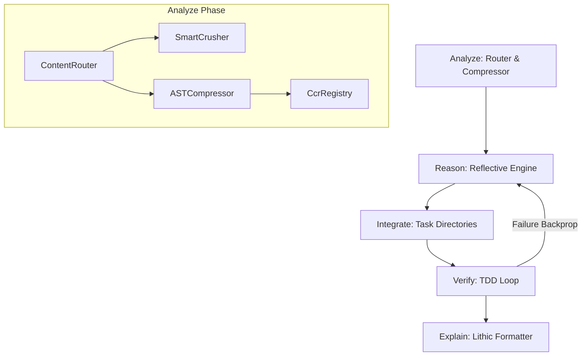

# ARIVE MCP Server

[](https://bun.sh/)
[](https://www.typescriptlang.org/)
[](https://modelcontextprotocol.io/)
[](LICENSE)

A complete, production-ready TypeScript Model Context Protocol (MCP) server that implements the **ARIVE** framework: **Analyze**, **Reason**, **Integrate**, **Verify**, **Explain**.

ARIVE merges local context compression, step-by-step backtracking reasoning graphs, isolated directory task runners, test verification loops, and telegraphic language output into a single, cohesive developer assistant engine.

---


## Benchmark Results: With vs. Without ARIVE MCP

The table below quantifies the performance delta of an LLM operating **with** the ARIVE MCP tools and sequential reasoning protocol versus a baseline model operating **without** them. Benchmarks are run via `promptfoo` and verified against real agent sessions.

| Metric | Without ARIVE MCP | With ARIVE MCP | Delta |
| :--- | :--- | :--- | :--- |
| **Reasoning Protocol Compliance** | 0% — skips gates, produces unstructured output | 100% — enforces all 5 phases (Scope, Evidence, Challenge, Verify, Report) | **Infinite improvement** — prevents rushed, logically incomplete work |
| **Tone & Style Guard** | Fails — informal greetings, emojis (`🚀`), exclamation marks | Passes — professional, telegraphic, objective, emoji-free | **Eliminates conversational fluff** — output is concise and rigorous |
| **Context Window Efficiency** | 0% savings — raw content repeatedly fills context | Up to 90% savings — `arive_compress` + CCR hash references | **Exponential token efficiency** — prompt size stays constant |
| **Verification & Self-Correction** | Single-pass guess — no compilation check, failures survive | Active TDD loop — `arive_verify` backpropagates failures into reasoning | **Correctness jumps** — code compiles and tests pass before yielding |

Run the benchmarks yourself:
```bash
# 1. Promptfoo single-run evaluation (Actual model: mimo-v2.5-free)
bun run benchmark

# 2. Multi-run prompt evaluation (Averages stats across 3 runs)
bun run benchmark:prompts

# 3. Toolset latency and token performance evaluation
bun run benchmark:toolset
```

For detailed methodology, multi-run statistics, and agent-based testing instructions, see [BENCHMARKS.md](BENCHMARKS.md).

## Architecture & Phases


```mermaid
graph TD
    A[Analyze: Router & Compressor] --> R[Reason: Reflective Engine]
    R --> I[Integrate: Task Directories]
    I --> V[Verify: TDD Loop]
    V -- Failure Backprop --> R
    V --> E[Explain: Lithic Formatter]

    subgraph Analyze Phase
        ContentRouter --> SmartCrusher
        ContentRouter --> ASTCompressor
        ASTCompressor --> CcrRegistry
    end
```

### A - Analyze (Context Compression)

- **Content Router**: Automatically classifies incoming text blocks into `json`, `code`, `logs`, or `prose` to determine the optimal compression strategy.
- **Smart JSON Crusher**: Recursively traverses JSON data, collapsing large arrays with more than 2 elements and replacing them with a summary description while preserving SRE/error fields.
- **AST Code Compressor**: Discards comments, JSDocs, whitespace runs, and formatting details using the TypeScript Compiler API.
- **Cache Aligner**: Normalizes spacing and carriage returns to ensure maximum KV cache hit rates on providers like Anthropic or Gemini.
- **CCR Registry**: A hash-based Content-Compressed Retrieval store (`ccr:sha256_hash`). Allows referencing large payloads using 68-character hashes.

### R - Reason (Step-by-Step Logic Sequences)

- **Reflective Engine**: Tracks thought sequences in a graph. Supports branching and backtracking: if a backtracking revision is requested, thoughts after the revision target are flagged as `"backtracked"` (retained in log but deactivated), and a new active sequence branches out. State is saved atomically to `.arive/thinking_state.json`.

### I - Integrate (Isolated Workspaces)

- **Directory Isolation**: Spawns isolated, concurrent task directories under `.arive-tasks/<taskId>`. Prevents modifying the user's active files during automated refactoring/mutation runs.
- **Subagent Runner**: Spawns CLI commands inside the isolated directory, guarding against sandbox directory escapes and command injection, and capturing subprocess runtime errors.

### V - Verify (TDD & Verification Loops)

- **TDD Orchestrator**: Executes verification tests (e.g., `bun test`, `pytest`) inside the isolated CWD.
- **Backprop Reflex**: Integrates assertion failures back into the reasoning history, prompting the engine to revise its hypothesis on subsequent iterations.
- **CCR Verification**: Validates that retrieved raw content matches its original hash key before usage.

### E - Explain (Lithic Token Compression)

- **Lithic Formatter**: Compresses conversational text into token-saving, telegraphic styles:
  - `lite`: Strips filler words ("just", "actually", "basically").
  - `full`: Strips articles ("the", "a") and auxiliary verbs ("is", "are").
  - `ultra`: telegraphic keyword mapping (e.g. `tests/verify.test.ts:24 fail`).
  - `normal`: Returns raw text without modification.

---

## Exposed MCP Tools

### `arive_compress`

Compresses strings based on code, JSON, logs or prose optimizations, returning hash references for large sizes.

| Parameter     | Type    | Required | Default | Description                                                      |
| :------------ | :------ | :------- | :------ | :--------------------------------------------------------------- |
| `content`     | string  | Yes      |         | The content raw text block to compress.                          |
| `contentType` | enum    | No       | `auto`  | Category of content: `json`, `code`, `logs`, `prose`, or `auto`. |
| `forceCcr`    | boolean | No       | `false` | Force storing the result in the CCR registry.                    |

### `arive_decompress`

Resolves CCR reference hashes back to their raw uncompressed representation.

| Parameter | Type   | Required | Default | Description                             |
| :-------- | :----- | :------- | :------ | :-------------------------------------- |
| `hash`    | string | Yes      |         | The CCR hash (e.g., `ccr:sha256_hash`). |

### `arive_think`

Records a single thought block in the reasoning sequence, managing backtracking.

| Parameter            | Type    | Required | Default | Description                                          |
| :------------------- | :------ | :------- | :------ | :--------------------------------------------------- |
| `thought`            | string  | Yes      |         | The reasoning thought text.                          |
| `thoughtNumber`      | integer | Yes      |         | The current thought index.                           |
| `totalThoughts`      | integer | Yes      |         | The estimated total thoughts.                        |
| `nextThoughtNeeded`  | boolean | Yes      |         | Whether another thought is expected after this one.  |
| `isRevision`         | boolean | No       |         | Flag indicating this thought revises a previous one. |
| `revisesThoughtNum`  | integer | No       |         | The thought number being revised.                    |
| `branchToThoughtNum` | integer | No       |         | The thought number to branch from (if backtracking). |

### `arive_integrate`

Controls the workspace lifecycle (local directory tasks) and spawns subprocesses.

| Parameter | Type   | Required | Default | Description                                               |
| :-------- | :----- | :------- | :------ | :-------------------------------------------------------- |
| `taskId`  | string | Yes      |         | Unique identifier for the task workspace.                 |
| `action`  | enum   | Yes      |         | The action to perform: `create`, `execute`, or `cleanup`. |
| `command` | string | No       |         | CLI command to execute when action is `execute`.          |

### `arive_verify`

Runs testing suites in the task directory workspace path and backpropagates failures.

| Parameter     | Type   | Required | Default | Description                                 |
| :------------ | :----- | :------- | :------ | :------------------------------------------ |
| `taskId`      | string | Yes      |         | Unique identifier for the task workspace.   |
| `testCommand` | string | Yes      |         | The test command to run (e.g., `bun test`). |

### `arive_explain`

Transforms conversational messages into telegraphic token-saving fade styles, or returns fade instruction rules.

| Parameter | Type   | Required | Default | Description                                                          |
| :-------- | :----- | :------- | :------ | :------------------------------------------------------------------- |
| `message` | string | Yes      |         | The natural language text to compress, or get instructions for.      |
| `brevity` | enum   | No       | `full`  | The level of brevity/laziness: `lite`, `full`, `ultra`, or `normal`. |


## ARIVE Protocol Lifecycle Hooks

The ARIVE framework supports executing custom pre- and post-hook scripts at different stages of tool executions. If the `.arive/hooks` directory exists, the server will check for files matching specific hook names:

- `pre-analyze` / `post-analyze` (run by `arive_compress`)
- `pre-reason` / `post-reason` (run by `arive_think`)
- `pre-verify` / `post-verify` (run by `arive_verify`)
- `pre-explain` / `post-explain` (run by `arive_explain`)
- `pre-compact` / `post-compact` (run when compact references replace large tool outputs)

### Automatic Prompt Guidance Hooks

ARIVE ships default post-hook scripts in `.arive/hooks/` to preserve context instead of repeating large structures:

- `post-analyze.js` — writes compact guidance to `.arive/compact_guidance.json` and reminds follow-up prompts to use `arive fade`, `arive reasoning`, and `arive mindvault`.
- `post-compact.js` — reminds the conversation to reference stored `ccr:` hashes instead of re-emitting raw expanded content.

### Global Hook Installation Across Code Editors & Assistants

To install active ARIVE lifecycle hooks globally across your code editor integrations, copy the non-sample TypeScript hook files from `.arive/hooks/` into the target client's global hooks directory:

| Code Editor / Client | Global Hooks Directory |
| :--- | :--- |
| **Universal / ARIVE Core** | `~/.arive/hooks/` |
| **omp (oh-my-pi)** | `~/.omp/hooks/` |
| **Gemini CLI (antigravity-cli)** | `~/.gemini/antigravity-cli/hooks/` |
| **Claude Desktop / Claude Code** | `~/.claude/hooks/` or `~/.claudecode/hooks/` |
| **OpenCode / KiloCode** | `~/.config/opencode/hooks/` or `~/.kilocode/hooks/` |
| **VS Code (Cline / Roo Code)** | `~/.cline/hooks/` or `~/.roo/hooks/` |
| **Cursor** | `~/.cursor/hooks/` |

#### Installation Command

Run the following command from the root of the ARIVE repository to copy all active lifecycle hooks to your desired global hook location (replace `~/.omp/hooks` with your target client directory, e.g., `~/.claude/hooks`, `~/.cursor/hooks`, etc.):

```bash
# Ensure you are at the root of the ARIVE repository
cd /path/to/ARIVE

# Set target global hooks directory (e.g. ~/.omp/hooks, ~/.claude/hooks, ~/.cursor/hooks)
TARGET_DIR=~/.omp/hooks

# Create target directory
mkdir -p "$TARGET_DIR"

# Dynamically copy all active ARIVE lifecycle hooks without overwriting customized hooks (-n)
cp -n .arive/hooks/*.ts "$TARGET_DIR"/
```

### Environment Variables

---

## Installation & Setup

### Requirements

- [Bun](https://bun.sh/) (runtime & package manager)
- [Git](https://git-scm.com/)

### Clone and Install

```bash
# Clone the repository
git clone https://github.com/sixtysixx/ARIVE.git
cd ARIVE

# Install dependencies
bun install
```

### Running Tests

```bash
bun test
```

### Type Checking

```bash
bun x tsc --noEmit
```

### Running Benchmarks & Evaluations (With vs. Without MCP Tools)

The repository integrates `promptfoo` to run comparative benchmarks measuring the performance delta of models operating **with** the ARIVE MCP tools and sequential reasoning rules versus a baseline model **without** them.

Run the side-by-side comparative evaluation locally:

```bash
bun run benchmark
```

This evaluates prompts for reasoning gate compliance (Scope, Evidence, Challenge, Verify, Report), style constraints, and token efficiency. For details on the comparison metrics and using real LLMs, see [BENCHMARKS.md](BENCHMARKS.md)
---

## Client Configurations

Two launch modes are supported:

```text
bun run src/index.ts          # local checkout, near-instant start
bunx --silent github:sixtysixx/ARIVE  # fetches from GitHub
```

If the client times out during first startup, use the local command.

To register the ARIVE MCP server in your local AI editing clients:

### Gemini CLI (`antigravity-cli`)

ARIVE ships a root-level `plugin.json`, `mcp_config.json`, `rules/`, and `skills/` so the entire repo is a valid Antigravity plugin. Install it in one command:

```bash
agy plugin install github:sixtysixx/ARIVE
```

The CLI stages the plugin at `~/.gemini/antigravity-cli/plugins/arive/` and automatically loads the MCP server, Fade rules, and skills on next launch.

Alternatively, register the MCP server manually in `%USERPROFILE%\.gemini\antigravity-cli\mcp_config.json`:

```json
{
  "mcpServers": {
    "arive": {
      "command": "github:sixtysixx/ARIVE"
    }
  }
}
```

### omp (oh-my-pi)

Add this configuration to your user-level config at `~/.omp/agent/mcp.json` or your project-level config at `.omp/mcp.json`:

```json
{
  "mcpServers": {
    "arive": {
      "command": "github:sixtysixx/ARIVE"
    }
  }
}
```

### Claude Desktop

Add this to your configuration (e.g., `%APPDATA%\EasyCode\claude_desktop_config.json` or standard `claude_desktop_config.json` configuration path):

```json
{
  "mcpServers": {
    "arive": {
      "command": "github:sixtysixx/ARIVE"
    }
  }
}
```

### OpenCode

ARIVE ships a root-level `opencode.mjs` plugin module. Add the repo as a plugin in your global config (`~/.config/opencode/opencode.json`) or project config (`.opencode/opencode.json`) and the MCP server registers automatically:

```json
{
  "plugin": ["github:sixtysixx/ARIVE"]
}
```

Alternatively, register the MCP server manually:

```json
{
  "mcp": {
    "arive": {
      "type": "local",
      "command": ["bun", "run", "src/index.ts"],
      "enabled": true
    }
  }
}
```

### KiloCode

KiloCode shares the same plugin architecture as OpenCode. Add the repo as a plugin in your KiloCode config and the MCP server registers automatically:

```json
{
  "plugin": ["github:sixtysixx/ARIVE"]
}
```

Alternatively, use the **MCP Servers** panel (gear icon → **Edit Global MCP**), or define it locally under `.kilocode/mcp.json`:

```json
{
  "mcpServers": {
    "arive": {
      "command": "bun",
      "args": ["x", "--silent", "github:sixtysixx/ARIVE"]
    }
  }
}
```

### VS Code (Cline & Roo Code)

You can configure this globally (via the **MCP Servers** tab in the Cline/Roo Code pane, clicking **Edit Global MCP**) or locally for a specific workspace:

- **Cline Project-Level Config:** `.cline/mcp.json`
- **Roo Code Project-Level Config:** `.roo/mcp.json`

```json
{
  "mcpServers": {
    "arive": {
      "command": "bun",
      "args": ["x", "--silent", "github:sixtysixx/ARIVE"]
    }
  }
}
```

### Cursor

Add this through the Cursor settings UI under **Settings > Features > MCP**, clicking **Add new MCP server** (with type `stdio` and command `bunx --silent github:sixtysixx/ARIVE`), or add it manually to your project's `.cursor/mcp.json`:

```json
{
  "mcpServers": {
    "arive": {
      "command": "bun",
      "args": ["x", "--silent", "github:sixtysixx/ARIVE"]
    }
  }
}
```

## License

This project is licensed under the MIT License - see the [LICENSE](LICENSE) file for details.

---

## Credits

ARIVE integrates ideas and pipelines from the following core development paradigms - Thank you for the inspiration:

- **headroom** (`headroomlabs-ai/headroom`): Local, reversible context compression.
- **sequentialthinking** (`modelcontextprotocol/servers/sequentialthinking`): Step-by-step reasoning with reflective backtracking.
- **ponytail** (`DietrichGebert/ponytail`): Lazy senior dev mode rulesets, skills, and plugins.
- **mempalace** (`MemPalace/mempalace`): Memory palace-inspired knowledge retention and recall patterns.